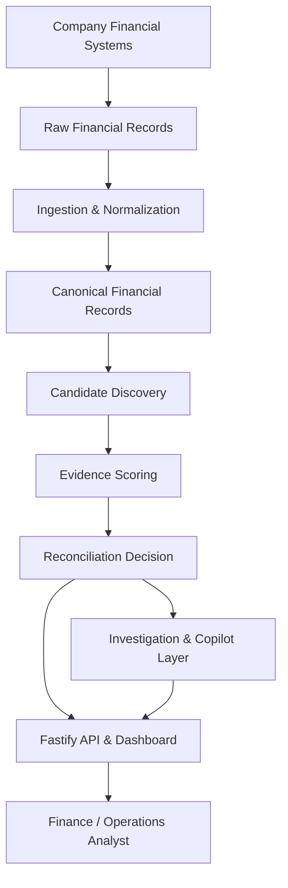

# LedgerLens

LedgerLens is a financial reconciliation and exception investigation platform that ingests records from disparate financial systems, normalizes heterogeneous schemas, discovers candidate transaction relationships, deterministically resolves matches, flags ambiguous and unmatched exceptions, and provides an explanatory investigation layer for finance and operations analysts.

## Problem

Modern organizations process financial events across fragmented systems, including commerce platforms, payment gateways, merchant processors, ERP ledgers, and bank clearing networks. Orders, payments, settlements, refunds, fee adjustments, and bank statement lines often reside in isolated data stores with differing timestamps, schema conventions, currency formatting, and reference identifiers.

Connecting and reconciling these records reliably is critical for closing financial books and detecting revenue leakage. As transaction volumes grow, manual reconciliation becomes error-prone and costly. LedgerLens addresses this challenge by automatically resolving high-confidence transaction pairs through deterministic evidence scoring while isolating exceptions and surfacing actionable investigation context. LedgerLens functions as an analytical reconciliation pipeline and does not replace core transactional databases.

## Solution

LedgerLens implements a structured multi-stage reconciliation workflow:

```
Raw Financial Records
        ↓
Ingestion & Normalization
        ↓
Candidate Discovery (Hard Eligibility Rules)
        ↓
Evidence Scoring (Additive Weights)
        ↓
Deterministic Resolution (RESOLVED / AMBIGUOUS / UNMATCHED)
        ↓
AI Investigation & Analyst Action Layer
        ↓
Operations Dashboard
```

The system strictly decouples **deterministic reconciliation** from the **investigation layer**:
- **Deterministic Core**: Pure TypeScript engine evaluating explicit compatibility rules, temporal windows, and evidence point thresholds. It holds sole authority over match decisions.
- **Investigation Layer**: Downstream analytical copilot powered by Gemini (with a deterministic rule fallback) that consumes finalized reconciliation results to assess operational risk, assign attention priorities, and generate concrete analyst action items.

## Why Deterministic First?

Financial reconciliation demands complete auditability, repeatability, and mathematical precision. In financial operations, an algorithm must never "guess" a link or hide ambiguity behind a non-deterministic similarity metric. 

LedgerLens enforces a deterministic-first architecture:
- **Hard Rules Determine Eligibility**: Transactions are only paired if they satisfy strict domain relationships, identical currencies, valid chronological order, and amount boundaries.
- **Explicit Evidence Determines Ranking**: Candidate matches are scored using visible, auditable evidence criteria (+100 for exact reference, +20 for amount, +10 for currency, +10 for temporal window).
- **Ambiguity Is Surfaced, Never Guessed**: When multiple candidate records share identical evidence scores, LedgerLens flags the flow as `AMBIGUOUS` for analyst review rather than making an arbitrary choice.
- **AI Is Strictly Downstream**: Large language models are leveraged exclusively for explaining verified outcomes, summarizing batch health, and recommending analyst workflows.

## Key Features

- **Synthetic Financial Universe**: Deterministic generation of multi-leg financial lifecycles with isolated ground truth.
- **8 Reconciliation Scenarios**: Standard flows, partial refunds, delayed settlements, missing bank entries, split settlements, duplicate references, fee adjustments, and unresolved discrepancies.
- **Strict Ingestion Validation**: Ingestion boundary isolating invalid payloads while allowing valid batch items to proceed.
- **Integer Minor-Unit Money Handling**: Decimal-safe conversion avoiding IEEE-754 floating-point arithmetic.
- **Timestamp Normalization**: Multi-format parsing for ISO-8601 strings, Unix seconds, and Unix milliseconds.
- **Duplicate Detection**: Batch-level duplicate record ID identification.
- **Typed Rejection Reasons**: Diagnostic rejection codes (`MISSING_ID`, `INVALID_TYPE`, `INVALID_AMOUNT`, `NEGATIVE_AMOUNT`, `INVALID_TIMESTAMP`, `DUPLICATE_ID`, `NEGATIVE_FEE`, `INVALID_CURRENCY`).
- **Deterministic Candidate Discovery**: Directional pairing across supported transaction types within configurable temporal windows.
- **Evidence-Based Scoring**: Additive point system evaluating reference equality, amount boundaries, currency matching, and temporal proximity.
- **Explicit Match Categorization**: Distinct `RESOLVED`, `AMBIGUOUS`, and `UNMATCHED` outcomes.
- **Fastify API**: High-throughput HTTP backend with batch boundaries and schema validation.
- **Next.js Dashboard**: Dark operations console with KPI metrics, filterable results, and candidate visualizer.
- **Rejected-Record Inspector**: Dedicated interface for reviewing schema validation failures.
- **Analyst Action Engine**: Structured case investigation with risk classifications (`LOW`, `MEDIUM`, `HIGH`) and attention levels (`REVIEW_REQUIRED`, `MONITOR`, `NO_ACTION`).
- **Gemini Integration**: Automated natural-language case briefs, executive summaries, and conversational Q&A (`gemini-1.5-flash`).
- **Deterministic Fallback**: Comprehensive rule-grounded investigation reports when external providers are unconfigured.
- **Automated Test Coverage**: 122 automated unit and integration tests across the workspace.

## Architecture



The architecture consists of modular TypeScript packages organized in a monorepo:
1. **Normalization Layer (`@ledgerlens/ingestion`)**: Translates messy incoming payloads into immutable domain records (`FinancialRecord`).
2. **Reconciliation Core (`@ledgerlens/reconciliation-engine`)**: Pure mathematical pairing and scoring engine containing zero external runtime dependencies.
3. **Investigation Package (`@ledgerlens/ai-investigator`)**: Downstream explanation engine that consumes structured decisions from the core engine to generate analyst recommendations.
4. **API Application (`apps/api`)**: Fastify server exposing ingestion, reconciliation, and investigation endpoints.
5. **Dashboard Application (`apps/dashboard`)**: Next.js single-page application for operational review.

## End-to-End Flow

```
User (Browser)
      ↓
Next.js Dashboard (apps/dashboard)
      ↓ Load Demo Data (generateDataset in memory)
      ↓ Click "Run Reconciliation"
Fastify API (POST /reconcile)
      ↓ normalizeRecords()
      ↓ discoverCandidates()
      ↓ resolveCandidates()
Reconciliation Result JSON (summary, records, rejected, candidates, results)
      ↓
Next.js Dashboard (Render KPI Cards, Results Table, and Rejections)
      ↓ Automatic Batch Brief (POST /investigate/summary)
      ↓ On Record Select (POST /investigate)
      ↓ On Analyst Q&A (POST /investigate/ask)
AI Investigation Layer (Gemini 1.5 Flash / Deterministic Fallback)
      ↓
Finance & Operations Analyst
```

## Reconciliation Pipeline

LedgerLens does **not** perform naive all-to-all record comparisons or assign arbitrary similarity scores. Every transaction passes through three explicit stages: hard eligibility filtering, deterministic evidence scoring, and candidate resolution.

```
Raw Record Batch
       ↓
1. Ingestion & Normalization
       ↓
2. Hard Eligibility Checks (Currency, Chronology, 7-Day Window, Directional Amount Bounds)
       ↓
3. Candidate Discovered? ──(No)──→ Mark UNMATCHED (Score: 0)
       ↓ (Yes)
4. Evidence Scoring (Exact Reference +100, Amount +20, Currency +10, Time Window +10)
       ↓
5. Candidate Ranking & Score Comparison
       ├── Unique Highest Score ──→ RESOLVED
       └── Top Score Tie ──────────→ AMBIGUOUS (Never Guessed)
```

### 1. Ingestion and Normalization
The ingestion engine receives raw objects (`RawRecord`) containing heterogeneous alias names (such as `transaction_id`, `created_at`, `transaction_amount`, or `fee`). It executes:
- **Alias Resolution**: Normalizes fields to canonical keys (`id`, `type`, `amount`, `currency`, `timestamp`, `reference`).
- **Money Conversion**: Parses strings and numbers into integer minor units (e.g., `$100.50` or `"100.50"` becomes `10050`). Decimal precision beyond two places or non-numeric tokens are rejected.
- **Timestamp Parsing**: Converts ISO-8601 strings, Unix second numbers, and Unix millisecond timestamps into canonical JavaScript `Date` instances.
- **Batch Resiliency**: Invalid entries are appended to a typed `rejected` array with specific failure codes, while valid entries continue to candidate discovery.

### 2. Candidate Discovery
The engine evaluates potential relationships across canonical records based on directional domain rules. Unsupported type combinations (such as `ORDER -> SETTLEMENT` or `BANK_ENTRY -> ORDER`) are never evaluated as candidate matches.

| Source Record | Target Record | Amount Eligibility Rule | Purpose |
| :--- | :--- | :--- | :--- |
| `ORDER` | `PAYMENT` | Exact equality (`source.amount === target.amount`) | Confirm order payment |
| `PAYMENT` | `SETTLEMENT` | Subset or equality (`target.amount <= source.amount`) | Settlement net of fees / batch payouts |
| `PAYMENT` | `REFUND` | Subset or equality (`target.amount <= source.amount`) | Refund cannot exceed original payment |
| `PAYMENT` | `ADJUSTMENT` | Absolute value bound (`Math.abs(target.amount) <= source.amount`) | Handle positive/negative fee or dispute adjustments |
| `SETTLEMENT` | `BANK_ENTRY` | Exact equality (`source.amount === target.amount`) | Confirm bank clearing |

A pair is accepted as a candidate match only if it satisfies all four baseline constraints:
1. **Currency Compatibility**: Currencies must be identical (`source.currency === target.currency`).
2. **Chronological Ordering**: Target timestamp must occur at or after source timestamp (`target.timestamp >= source.timestamp`).
3. **Temporal Window**: Target must occur within 7 days ($604,800,000\text{ ms}$) of the source. This 7-day temporal window is a configurable operational assumption for the pipeline rather than a universal financial law.
4. **Relationship Amount Compatibility**: Must satisfy the specific relationship amount rule listed in the table above.

### 3. Evidence Scoring
Evidence points are calculated **only** after a candidate pair passes all hard eligibility checks. A candidate pair does not receive points for being "somewhat similar":
- Currency mismatch $\rightarrow$ eliminated immediately (0 points, no candidate created).
- Target timestamp preceding source $\rightarrow$ eliminated immediately.
- Target outside the 7-day temporal window $\rightarrow$ eliminated immediately.
- Amount outside relationship boundary $\rightarrow$ eliminated immediately.

Eligible candidates receive deterministic additive points:

| Evidence Criterion | Points | Rule Condition |
| :--- | :--- | :--- |
| `EXACT_REFERENCE` | 100 | Source and target share non-empty, identical reference strings |
| `AMOUNT_COMPATIBLE` | 20 | Amounts satisfy relationship-specific directional bounds |
| `CURRENCY_COMPATIBLE` | 10 | Exact currency code match |
| `TIME_WINDOW_COMPATIBLE` | 10 | Chronological order satisfied within 7-day temporal window |

The maximum possible evidence score is **140** ($100 + 20 + 10 + 10$). An eligible candidate without a matching reference receives a baseline score of **40** ($20 + 10 + 10$). This is deterministic evidence weighting, not an AI confidence probability.

### 4. Resolution
Source records (`ORDER`, `PAYMENT`, `SETTLEMENT`) receive one of three mutually exclusive outcomes:
- **`RESOLVED`**: Exactly one candidate holds the strictly highest evidence score. The winning candidate ID is recorded in `matchedRecordIds`.
- **`AMBIGUOUS`**: Two or more candidates tie for the highest evidence score. Competing candidate IDs are captured in `candidateRecordIds`, and `matchedRecordIds` remains empty. The engine refuses to guess without differentiating evidence.
- **`UNMATCHED`**: Zero candidates satisfied the discovery rules.

#### Ambiguity and Resolution Examples

**Example 1: Ambiguous Score Tie**
```
Payment P (₹10,000, Ref: REF-100)
├── Settlement A (₹9,950, Fee: ₹50, Ref: REF-100) → Evidence Score: 140
└── Settlement B (₹9,950, Fee: ₹50, Ref: REF-100) → Evidence Score: 140

Outcome: AMBIGUOUS
matchedRecordIds: []
candidateRecordIds: ["stl_A", "stl_B"]
```
*LedgerLens deliberately refuses to guess between equally strong candidates.*

**Example 2: Resolved Unique Winner**
```
Payment P (₹10,000, Ref: REF-100)
├── Settlement A (₹9,950, Fee: ₹50, Ref: REF-100) → Evidence Score: 140
└── Settlement B (₹9,950, Fee: ₹50, Ref: REF-999) → Evidence Score: 40

Outcome: RESOLVED
matchedRecordIds: ["stl_A"]
candidateRecordIds: ["stl_A", "stl_B"]
```

## Financial Scenarios

The synthetic data package (`@ledgerlens/synthetic-data`) deterministically generates realistic transaction lifecycles covering 8 distinct scenarios. These scenarios exist to exercise specific reconciliation behaviors:

- **`CLEAN`**: Tests the standard end-to-end 4-leg reconciliation flow (`ORDER -> PAYMENT -> SETTLEMENT -> BANK_ENTRY`) with matching references and fees.
- **`PARTIAL_REFUND`**: Tests subset amount compatibility and multi-target discovery (`PAYMENT -> REFUND` and `PAYMENT -> SETTLEMENT`).
- **`DELAYED_SETTLEMENT`**: Tests temporal boundary enforcement by generating settlements beyond the 7-day window to verify candidate exclusion.
- **`MISSING_BANK_ENTRY`**: Tests exception handling when processor settlements occur but corresponding bank clearing lines are omitted.
- **`SPLIT_SETTLEMENT`**: Tests single payments cleared across multiple partial settlement records whose sum equals the net principal.
- **`DUPLICATE_REFERENCE`**: Tests ambiguity handling when identical merchant references appear across independent transaction flows.
- **`ADJUSTMENT`**: Tests positive and negative ledger adjustment bounds (`Math.abs(amount) <= payment.amount`).
- **`UNRESOLVED`**: Tests exception surfacing when counterpart records are missing from the ingestion dataset.

### Role of Ground Truth
Synthetic datasets generate two distinct objects:
1. **Visible Dataset (`dataset.records`)**: The collection of canonical financial records received and processed by LedgerLens. Visible records contain no hidden foreign keys or relationship indicators.
2. **Ground Truth (`groundTruth.relations`)**: A separate relational map used strictly in automated test suites to verify matching precision.

The reconciliation engine does **not** receive ground truth. The AI investigator does **not** receive ground truth.

## AI Investigation Layer

The AI investigation layer (`@ledgerlens/ai-investigator`) functions strictly as a post-reconciliation copilot.

```
Deterministic Engine
        ↓
Final Reconciliation Result (RESOLVED / AMBIGUOUS / UNMATCHED)
        ↓
AI Investigator
        ↓
Structured Output: Explanation / Risk / Recommended Actions / Copilot Q&A
```

### Operational Boundaries

Gemini does **NOT**:
- Discover matches
- Calculate evidence scores
- Select winners
- Resolve ambiguity
- Modify reconciliation results
- Access hidden ground truth

Gemini **DOES**:
- Explain deterministic results using visible record fields and score criteria
- Summarize batch health for leadership
- Classify operational risk (`LOW`, `MEDIUM`, `HIGH`) and attention levels (`REVIEW_REQUIRED`, `MONITOR`, `NO_ACTION`)
- Recommend concrete next steps for finance analysts
- Answer contextual case questions

### Provider Configuration & Fallback

The package supports Google Gemini via the Google AI REST API (`gemini-1.5-flash` primary model, with fallback support for `gemini-2.0-flash` and `gemini-1.5-flash-8b`), as well as OpenAI (`gpt-4o-mini`).

Provider resolution priority:
1. If `options.preferredProvider` is set, it selects that provider if configured.
2. Checks `GEMINI_API_KEY` or `GOOGLE_API_KEY` (selects Gemini).
3. Checks `OPENAI_API_KEY` (selects OpenAI).
4. If no API key is present, or if an API call fails or times out, it automatically falls back to **Deterministic Fallback Mode**.

The deterministic fallback generates structured investigation reports matching the identical TypeScript schema with zero external network requests.

## Database Status

The repository contains `@ledgerlens/database` with a Prisma schema configured for PostgreSQL.

- **Demo Runtime**: The current demo processes transaction batches in memory for instant local execution without requiring database setup.
- **Production Architecture**: In an enterprise deployment, `@ledgerlens/database` attaches persistent event logs, transaction tables, and audit history to the pipeline.

## API

The backend Fastify server (`apps/api`) runs on port 3001 and enforces a 1000-record batch limit (`MAX_BATCH_SIZE = 1000`).

### `GET /health`
Returns service operational status.
```json
{
  "status": "ok",
  "service": "ledgerlens-api"
}
```

### `POST /ingestions`
Normalizes raw input records and reports schema validation rejections.
- **Request**: `{ "records": [ ...rawObjects ] }`
- **Response**: `{ "records": [ ...normalized ], "rejected": [ ...rejections ], "acceptedCount": 10, "rejectedCount": 0 }`

### `POST /reconcile`
Executes full ingestion, candidate discovery, and deterministic resolution.
- **Request**: `{ "records": [ ...rawObjects ] }`
- **Response**:
```json
{
  "summary": {
    "totalInputRecords": 100,
    "acceptedRecords": 98,
    "rejectedRecords": 2,
    "resolved": 80,
    "ambiguous": 10,
    "unmatched": 8,
    "candidateCount": 95
  },
  "records": [ ...normalizedRecords ],
  "rejected": [ ...rejectedRecords ],
  "candidates": [ ...discoveredCandidates ],
  "results": [ ...resolutionResults ]
}
```

### `GET /investigate/info`
Returns the active AI provider status.
```json
{
  "provider": "gemini",
  "isAiConfigured": true
}
```

### `POST /investigate`
Generates a structured investigation report for a specific source record.
- **Request**: `{ "record": { ... }, "result": { ... }, "candidates": [ ... ] }`
- **Response**:
```json
{
  "summary": "PAYMENT pay_100 was uniquely resolved to SETTLEMENT stl_100 with evidence score 140/140.",
  "whyThisStatus": "Candidate stl_100 attained the strictly highest evidence score without tie.",
  "explanation": "A unique candidate achieved the highest evidence score of 140/140 based on exact matching criteria.",
  "keyEvidence": ["Exact Reference Match (+100 pts)", "Amount Compatibility (+20 pts)"],
  "riskLevel": "LOW",
  "attentionLevel": "NO_ACTION",
  "recommendedAction": "Proceed with automated ledger posting and batch settlement closure.",
  "recommendedActions": [
    "Proceed with automated ledger posting and batch settlement closure.",
    "Verify standard clearing house confirmation in next scheduled cycle."
  ],
  "questionsToInvestigate": ["Confirm final bank ledger posting status with clearing network."],
  "provider": "gemini"
}
```

### `POST /investigate/summary`
Generates an executive management brief from batch reconciliation counts.
- **Request**: `{ "summary": { ...reconciliationSummary } }`
- **Response**: `{ "overview": "...", "keyFindings": [ ... ], "attentionRequired": [ ... ], "recommendedNextSteps": [ ... ], "provider": "gemini" }`

### `POST /investigate/ask`
Answers contextual case questions from operations analysts.
- **Request**: `{ "question": "Why is this ambiguous?", "context": { "record": { ... }, "result": { ... }, "candidates": [ ... ] } }`
- **Response**: `{ "answer": "...", "provider": "gemini" }`

## Dashboard

The Next.js dashboard (`apps/dashboard`) provides an interactive console for financial operations:
- **Load Demo Data**: Generates synthetic multi-scenario transaction flows in client memory.
- **Run Reconciliation**: Submits the batch to `POST /reconcile` and updates client state.
- **KPI Summary Cards**: Real-time counters for Total Records, Ingested, Resolved, Ambiguous, Unmatched, and Ingestion Rejections.
- **Executive AI Brief**: Automated batch synthesis detailing key findings, attention items, and recommended next steps.
- **Filterable Results Table**: Search and filter by status (`ALL`, `RESOLVED`, `AMBIGUOUS`, `UNMATCHED`, `REJECTED`), record ID, or reference.
- **Analyst Action Panel**: Dedicated case inspector displaying Risk Level (`LOW`, `MEDIUM`, `HIGH`), Attention Level (`REVIEW_REQUIRED`, `MONITOR`, `NO_ACTION`), narrative justification, and numbered action items.
- **Evidence Breakdown**: Visual point score allocation (`+100`, `+20`, `+10`, `+10`).
- **Interactive Copilot**: Real-time Q&A chat for investigating specific case nuances.
- **Rejected Record Inspector**: Dedicated tab for inspecting raw payload failures and diagnostic rejection reasons.

## Project Structure

```
ledgerlens/
├── apps/
│   ├── api/                       # Fastify HTTP backend
│   └── dashboard/                 # Next.js React frontend
├── packages/
│   ├── shared/                    # TypeScript interfaces, domain types, and schemas
│   ├── ingestion/                 # Raw record validation and money/timestamp normalizer
│   ├── reconciliation-engine/     # Candidate discovery and evidence resolution engine
│   ├── synthetic-data/            # Synthetic flow generator with ground-truth isolation
│   ├── ai-investigator/           # Gemini integration and deterministic fallback provider
│   └── database/                  # Prisma schema definitions
├── package.json                   # Turborepo workspace configuration
├── tsconfig.json                  # Root TypeScript configuration
└── README.md                      # Project documentation
```

### Package Responsibilities
- **`@ledgerlens/shared`**: Common contracts shared across all packages.
- **`@ledgerlens/ingestion`**: Untrusted data cleaning and schema normalization.
- **`@ledgerlens/reconciliation-engine`**: Deterministic candidate discovery and resolution.
- **`@ledgerlens/synthetic-data`**: Scenario generation and validation testing.
- **`@ledgerlens/ai-investigator`**: Natural-language explanation and risk classification.
- **`apps/api`**: REST API exposing the reconciliation pipeline.
- **`apps/dashboard`**: Web interface for financial analysts.

## Running Locally

### Prerequisites
- [Bun](https://bun.sh/) (v1.1+)

### 1. Install Dependencies
```sh
bun install
```

### 2. Configure Environment (Optional)
Create a `.env` file in the root directory to enable Gemini AI investigation:
```env
GEMINI_API_KEY=your_gemini_api_key_here
PORT=3001
NEXT_PUBLIC_API_URL=http://localhost:3001
```

If no `GEMINI_API_KEY` (or `GOOGLE_API_KEY`) is set, LedgerLens runs in **Deterministic Fallback Mode** with zero external network dependencies.

### 3. Start Development Servers
```sh
bun run dev
```

- **Dashboard**: `http://localhost:3000`
- **Fastify API**: `http://localhost:3001`

## Testing

Run the automated test suite across all workspace packages:
```sh
bun test
```

Verified test coverage:
- `packages/ai-investigator/index.test.ts`: 9 tests
- `packages/ingestion/index.test.ts`: 32 tests
- `packages/reconciliation-engine/index.test.ts`: 31 tests
- `packages/synthetic-data/index.test.ts`: 17 tests
- `apps/api/src/index.test.ts`: 33 tests
- **Total**: 122 passing tests across 5 test suites.

Run workspace typechecking:
```sh
bun run typecheck
```

Build the dashboard for production:
```sh
cd apps/dashboard
bun run build
```

## Demo Walkthrough

1. Start the application using `bun run dev`.
2. Open `http://localhost:3000` in your web browser.
3. Click **Load Demo Data** to generate synthetic financial flows in memory.
4. Click **Run Reconciliation** to send records through the Fastify API.
5. Review the **KPI Overview** and the **AI Executive Brief** card.
6. Select a **`RESOLVED`** row to inspect the single winning candidate, 140-point score breakdown, and `NO_ACTION` classification.
7. Select an **`AMBIGUOUS`** row to view candidate ties, duplicate reference evidence, and `REVIEW_REQUIRED` analyst guidance.
8. Select an **`UNMATCHED`** row to review missing counterpart diagnosis.
9. Filter by **`REJECTED`** to inspect records that failed ingestion normalization.
10. In the **Ask LedgerLens Copilot** box, enter questions such as *"Why is this ambiguous?"* or *"What action should I take?"* to receive contextual explanations.

## Design Decisions

- **Integer Minor-Unit Money Representation**: All amounts are represented as integer minor units (e.g. cents, paise) to eliminate floating-point rounding inaccuracies.
- **Deterministic Core Authority**: Financial matching logic is entirely deterministic, transparent, and auditable.
- **Explicit Evidence Weights**: Candidate compatibility is calculated via explicit point assignments rather than black-box probabilistic heuristics.
- **Surfaced Ambiguity**: When multiple candidates share identical evidence, the system marks the transaction `AMBIGUOUS` rather than guessing.
- **Isolated Ground Truth**: Hidden relationship links are segregated in test suites and never supplied to the reconciliation engine.
- **Ingestion Failure Isolation**: Ingestion validation failures are separated from reconciliation results, preventing malformed records from interrupting valid batches.
- **Downstream AI Role**: AI is restricted to explaining verified decisions and recommending operational actions.
- **In-Memory Runtime**: All pipeline stages operate in memory for rapid local testing and clean containerized execution.

## Limitations / Production Evolution

- **Runtime Persistence**: In this demo implementation, transaction batches are processed in memory. A production deployment would attach persistent event logs and PostgreSQL storage via `@ledgerlens/database`.
- **Direct System Connectors**: Financial records are currently submitted via JSON API batches. Production deployment would add polling connectors for Stripe, Adyen, Plaid, and core banking feeds.
- **Configurable Reconciliation Rules**: The 7-day matching window and evidence point thresholds are currently configured at the package level; an enterprise deployment would allow per-merchant and per-corridor custom rule definitions.

## Tech Stack

- **Runtime & Package Manager**: Bun v1.4.0
- **Monorepo Tooling**: Turborepo
- **Language**: TypeScript (Strict Mode)
- **Backend Framework**: Fastify
- **Frontend Framework**: Next.js (App Router)
- **UI Library**: React, Tailwind CSS v4
- **Icons**: Lucide React
- **AI Integration**: Google Gemini API (`gemini-1.5-flash`, with `gemini-2.0-flash` / `gemini-1.5-flash-8b` fallback and optional OpenAI `gpt-4o-mini` support)
- **Database Layer**: Prisma (`@ledgerlens/database`, schema configured for PostgreSQL; runtime operates in memory for demo)

## Final Notes

LedgerLens combines deterministic financial reconciliation with an investigation layer that helps analysts understand and act on exceptions.
